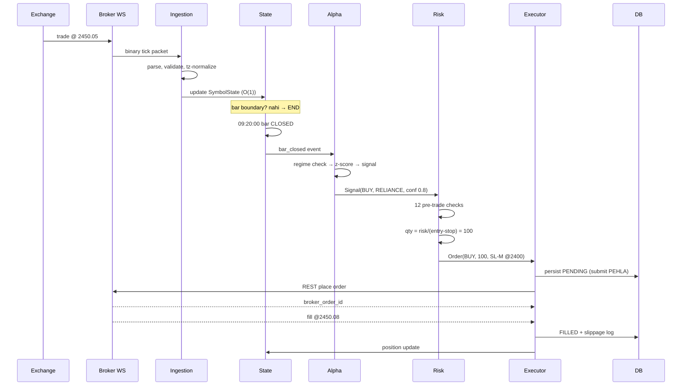

# 10 — System Design Playbook

> **Aa file design mode mate che.** Jyare tame architect kari rahya cho — code lakhta nathi, decide kari rahya cho — tyare aa kholo.
> Format: diagram → decision table → build order. Har decision sathe "kem".

---

## 1. Full Reference Architecture

```
╔═══════════════════════════════════════════════════════════════════════════╗
║                        LAYER 0 — EXTERNAL                                 ║
║   Broker WS feed │ Broker REST │ News/RSS │ Instrument master │ Bhavcopy   ║
╚════════╤════════════════╤═══════════════╤══════════════╤══════════════════╝
         │                │               │              │
╔════════▼════════════════▼═══════════════▼══════════════▼══════════════════╗
║                        LAYER 1 — INGESTION                                ║
║  ┌─────────────┐  ┌──────────────┐  ┌────────────────┐  ┌──────────────┐  ║
║  │ FeedClient  │  │ Validator    │  │ Normalizer     │  │ NewsWorker   │  ║
║  │ reconnect   │─►│ spike/session│─►│ token→symbol   │  │ async LLM    │  ║
║  │ heartbeat   │  │ quarantine   │  │ tz, decimals   │  │ → Redis feat │  ║
║  └─────────────┘  └──────────────┘  └───────┬────────┘  └──────┬───────┘  ║
╚═══════════════════════════════════════════════╪═════════════════╪══════════╝
                                                │                 │
╔═══════════════════════════════════════════════▼═════════════════▼══════════╗
║                        LAYER 2 — STATE & AGGREGATION                       ║
║  ┌────────────────┐   ┌────────────────┐   ┌────────────────┐             ║
║  │ BarAggregator  │   │ SymbolState    │   │ Feature cache  │             ║
║  │ tick→1m/5m     │──►│ RollingWindow  │◄──│ Redis feat:*   │             ║
║  │ session reset  │   │ EMA/ATR/VWAP   │   │ TTL 4h         │             ║
║  └────────────────┘   └───────┬────────┘   └────────────────┘             ║
╚════════════════════════════════╪═══════════════════════════════════════════╝
                                 │  bar_closed event
╔════════════════════════════════▼═══════════════════════════════════════════╗
║                        LAYER 3 — ALPHA                                     ║
║  ┌──────────────┐  ┌──────────────┐  ┌──────────────┐                     ║
║  │ RegimeDetect │─►│ MeanRevAlpha │  │ MomentumAlpha│  ← isolated modules  ║
║  │ Hurst/ADF/   │  │ (File 04)    │  │ (File 05)    │                     ║
║  │ ATR pct      │  └──────┬───────┘  └──────┬───────┘                     ║
║  └──────────────┘         └─────────┬───────┘                             ║
║                       Signal{symbol, direction, confidence, stop_ref}      ║
╚═════════════════════════════════════╪══════════════════════════════════════╝
                                      │
╔═════════════════════════════════════▼══════════════════════════════════════╗
║                LAYER 4 — RISK  ★ VETO POWER ★  (File 06)                   ║
║   PreTradeGate (12 checks) → PositionSizer → StopManager → CircuitBreaker  ║
║   Portfolio: exposure, correlation, sector caps, margin                    ║
║                    ❌ reject → log reason, DROP                            ║
╚═════════════════════════════════════╤══════════════════════════════════════╝
                                      │ approved Order
╔═════════════════════════════════════▼══════════════════════════════════════╗
║                LAYER 5 — EXECUTION (File 08)                               ║
║   OrderRouter (abstract) ──► PaperRouter │ LiveRouter                      ║
║   idempotency lock · retry policy · UNKNOWN handling · OCO/bracket mgmt    ║
╚═════════════════════════════════════╤══════════════════════════════════════╝
                                      │ fills
╔═════════════════════════════════════▼══════════════════════════════════════╗
║                LAYER 6 — STATE OF TRUTH                                    ║
║   Postgres/SQLite: orders · fills · positions · equity · exec_quality      ║
║   Reconciler (30s) ─── mismatch ──► HALT + ALERT                           ║
╚═════════════════════════════════════╤══════════════════════════════════════╝
                                      │
╔═════════════════════════════════════▼══════════════════════════════════════╗
║                LAYER 7 — OBSERVABILITY & FEEDBACK                          ║
║   Metrics · alerts · EOD report · slippage analysis ──► backtest params    ║
╚════════════════════════════════════════════════════════════════════════════╝
```

---

## 2. Data flow — ek tick ni safar



---

## 3. Module layout — repo structure

```
trading-system/
├── config/
│   ├── risk.yaml                 # ⚠️ market hours ma edit NAHI
│   ├── strategy.yaml
│   ├── costs.yaml                # STT/brokerage/GST — quarterly verify
│   └── universe.yaml
├── core/
│   ├── models.py                 # Order, Fill, Signal, Position (dataclasses)
│   ├── enums.py
│   └── clock.py                  # ⚠️ ek j time source. datetime.now() ban.
├── data/
│   ├── feed_client.py            # WS: reconnect, heartbeat, backpressure
│   ├── validator.py
│   ├── aggregator.py             # tick → bars, session reset
│   ├── state.py                  # SymbolState, RollingWindow, EMA, ATR
│   └── historical.py             # REST bars, corporate actions, PIT universe
├── features/
│   ├── indicators.py             # ⚠️ backtest ane live BANNE aaj vapare
│   ├── regime.py                 # Hurst, ADF, half-life, ATR percentile
│   └── news_worker.py            # async LLM → Redis
├── strategy/
│   ├── base.py                   # Strategy ABC: on_bar() → Signal|None
│   ├── mean_reversion.py
│   └── momentum.py
├── risk/
│   ├── sizer.py
│   ├── stops.py
│   ├── circuit_breaker.py
│   └── gate.py                   # 12 pre-trade checks
├── execution/
│   ├── router.py                 # ABC
│   ├── paper.py
│   ├── live.py
│   └── reconciler.py
├── backtest/
│   ├── engine.py                 # event-driven, live sathe same modules
│   ├── broker_sim.py             # costs, slippage, rejects, gaps
│   └── metrics.py
├── ops/
│   ├── monitor.py
│   ├── alerts.py
│   └── eod_report.py
├── storage/
│   ├── db.py
│   └── migrations/
└── main.py                       # wiring only, logic NAHI
```

> **Structural rule je badhu decide kare che:**
> `strategy/` ne `execution/` ni khabar na hovi joie. `strategy/` ne khabar na hovi joie ke live che ke backtest. Interface fakt: `on_bar(bar, state) → Signal | None`.
> Aa ek rule follow karso to "backtest ma chaltu hatu, live ma nahi" no aakho class of bugs eliminate thai jase.

---

## 4. Decision Tables — design ni vakhte

### Storage
| Need | Choice | Kem |
|---|---|---|
| <10 symbols, single process | SQLite + Parquet | Zero ops, fast enough |
| Multi-process, ACID | PostgreSQL | Transactions, concurrency |
| Fast cache / bus | Redis (Streams) | In-memory, replay-able |
| Tick history (crores rows) | ClickHouse / DuckDB+Parquet | Columnar, compression |
| Research dataframes | Parquet | Portable, fast, cheap |

### Concurrency
| Situation | Choice |
|---|---|
| I/O bound (WS + REST) | `asyncio` ✅ default |
| CPU bound (ADF, optimization) | `ProcessPoolExecutor`, hot loop ni bahar |
| Backtest parameter sweep | multiprocessing / joblib |
| Threads | ⚠️ GIL — fakt blocking library wrap karva |

### Bar frequency
| Freq | Trades/day | Cost drag | Suitable |
|---|---|---|---|
| 1-min | 10–30 | ⚠️ uncho | Fakt jyare edge > 0.3%/trade |
| **5-min** | 3–8 | manageable | ✅ intraday sweet spot |
| 15-min | 1–3 | low | ✅ swing intraday |
| Daily | <1 | negligible | ✅ positional, part-time |

### Deployment
| Stage | Setup |
|---|---|
| Dev | Local, historical replay |
| Paper | Mumbai VPS, DRY_RUN, 4 weeks |
| Live small | Same VPS, 10% size, alerts on |
| Live full | + monitoring dashboard, daily EOD digest |

---

## 5. Build Order — 12 weeks (aaj sequence rakho)

```
WEEK 1-2   FOUNDATION
  □ Broker API auth + instrument master + token mapping
  □ Historical REST bars → Parquet
  □ Corporate action adjustment + PIT universe
  □ SQLite schema: orders/fills/positions/equity
  ✅ Milestone: 2 varsh nu clean adjusted data, 20 symbols

WEEK 3-4   DATA PIPELINE (live)
  □ WS client: reconnect, heartbeat, backpressure
  □ Validator + quarantine
  □ Bar aggregator + session reset
  □ RollingWindow / EMA / ATR / VWAP
  ✅ Milestone: 6 kalak crash-free, bars bhavcopy sathe match

WEEK 5-6   BACKTEST ENGINE   ← ahiya shortcut NA lo
  □ Event-driven loop
  □ Broker sim: next-bar fill, slippage, costs, rejects
  □ Metrics module (Sharpe/Sortino/MDD/PF/expectancy)
  □ Walk-forward harness
  ✅ Milestone: buy&hold strategy NIFTY return exactly reproduce kare

WEEK 7-8   STRATEGY + RISK
  □ Strategy ABC + mean reversion + momentum
  □ Regime detector
  □ Sizer, stops, circuit breaker, pre-trade gate
  □ Full backtest with go/no-go checklist (File 07)
  ✅ Milestone: OOS Sharpe > 1.0, 100+ trades, plateau confirmed

WEEK 9-10  PAPER TRADING
  □ Router ABC + PaperRouter (rejects/latency inject)
  □ Reconciler, monitoring, Telegram alerts
  □ exec_quality logging
  ✅ Milestone: 4 weeks, zero unexplained mismatch,
                live signals ≈ backtest signals (>95%)

WEEK 11-12 LIVE (small)
  □ LiveRouter + idempotency + UNKNOWN handling
  □ EOD reconciliation + digest
  □ 10% size
  ✅ Milestone: measured slippage backtest assumption ni andar
```

> **Kem aa sequence:** ghana loko strategy thi shuru kare che (fun part) ane data/risk pachhi kare che. Pachhi strategy ne data ni shape par retrofit karvi pade che, ane risk ne strategy ma ghusadvo pade che — banne kharab thay che. **Boring layers pehla.**

---

## 6. Design Principles — 10 rules

```
1.  RISK LAYER ALAG HOVU JOIE ANE VETO POWER SATHE
      Strategy request kare, risk approve kare. Strategy jate size nakki na kare.

2.  BACKTEST ANE LIVE EK J CODE PATH
      Fakt router swap thay. Bija kai nahi. Aa ek rule 50% bugs marse.

3.  FAIL CLOSED, NOT OPEN
      Shanka? Trade nahi. Missing data → skip. Recon mismatch → halt.
      "Kadach thik hase" e mehngi line che.

4.  STATE PEHLA PERSIST, PACHHI ACT
      Order DB ma save karo, pachhi submit karo. Crash-safe.

5.  IDEMPOTENCY EVERYWHERE
      client_order_id, Redis locks. Retry duplicate na banave.

6.  HOT PATH SUDDH RAKHO
      Tick loop ma network nahi, disk nahi, pandas nahi. O(1) only.

7.  CONFIGURATION, CODE NAHI
      Risk/costs/params YAML ma, version controlled, audit log sathe.

8.  OBSERVABILITY OPTIONAL NATHI
      Je measure nathi thatu e break thay che chup-chaap.

9.  TIME NO EK J SOURCE
      core/clock.py. Backtest ma simulated, live ma real.
      Scattered datetime.now() = untestable system.

10. FEEDBACK LOOP BANDH KARO
      Live slippage → backtest assumption → re-validate → deploy.
      Aa loop vagar system roz roz vadhare juthu bolse.
```

---

## 7. Failure taxonomy — "aa failure thay to system shu kare?"

Design review ma aa table par ek-ek line jao. Jawab "khabar nathi" hoy to design adhuru che.

| Failure | System nu behaviour |
|---|---|
| WS disconnect | Backoff reconnect, resubscribe, meanwhile no new orders |
| WS alive pan stale | >10s → WARN, >30s → HALT |
| Broker REST 5xx | Retry with backoff; order mate query-then-retry |
| Order timeout | UNKNOWN → query by client_id → adopt ke halt |
| Partial fill | Position update, remaining cancel ke re-quote (rule nakki karo) |
| Reject: margin | Log, alert, skip; sizing ghatadvu ke nahi e config |
| Reject: freeze qty | Order slice |
| Process crash | Systemd restart → DB load → broker recon → halt if mismatch |
| Redis down | Cached features gum → strategy features 0 gane, chalu rahe |
| DB down | 🔴 HALT. Truth vagar trade nahi. |
| Power/network loss | Broker-side SL (bracket) ke separate watchdog |
| Circuit limit hit | Exit possible nathi — position size limit aaj mate |
| Corporate action miss | Daily validation alert, e symbol suspend |
| Daily loss limit | Flatten all, halt till next day |
| Max DD limit | Halt permanent, manual review |
| Clock drift | NTP check startup + hourly; drift > 1s → alert |

---

## 8. Design review checklist (nava component pehla puchho)

```
□ Aa component fail thay to shu thay? Fail-closed che?
□ Backtest ma ane live ma ek j che? Nahi to kem nahi?
□ State kya rahe che? Crash pachhi recover thase?
□ Hot path ma che? To O(1) che?
□ Kai measure thay che? Alert che?
□ Config ma che ke hardcoded?
□ Risk layer ne bypass to nathi kartu?
□ Idempotent che?
□ Test kevi rite karis? (test na lakhi shako to design bahu coupled che)
```

---

## Margin Questions
1. Strategy layer ne execution ni khabar kem na hovi joie?
2. "Fail closed" na 3 concrete example?
3. Persist-before-submit kem?
4. Build order ma data/backtest ne strategy pehla kem?
5. clock.py ek j time source kem joie?
6. Feedback loop (live slippage → backtest) na vagar shu thay?
