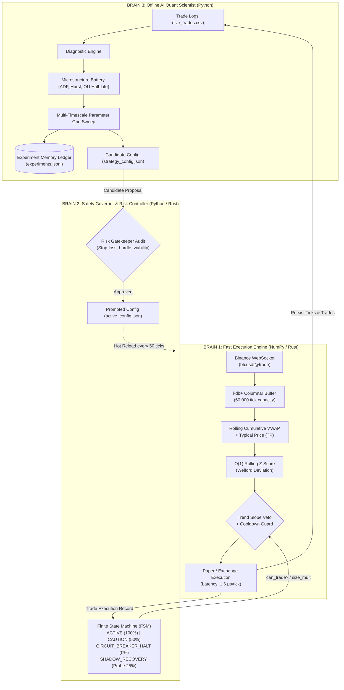
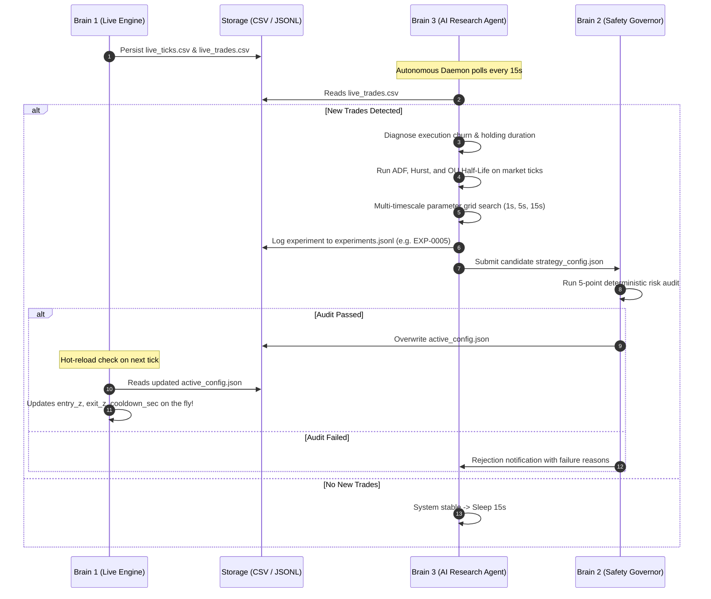

# Three-Brain Quantitative Architecture

> [!IMPORTANT] Core Architectural Axiom
> **An AI model or LLM must NEVER sit in the live tick-to-trade hot path.**
> - Market ticks arrive every **10–100 milliseconds**.
> - Order-book execution decisions require **sub-millisecond (< 50 μs)** determinism.
> - LLM inference takes **500 ms to 3+ seconds** and is non-deterministic.
> - Therefore, institutional architecture cleanly bifurcates into **Three Decoupled Brains**.

---

## 1. System Topology Overview

---

## 2. Brain Breakdown & Responsibilities

### Brain 1: Fast Execution Hot Path (Microseconds)
- **Implementation:** [`live_quant_server.py`](file:///D:/projects/QUANT/live_quant_server.py) (NumPy) & [`rust_engine/src/main.rs`](file:///D:/projects/QUANT/rust_engine/src/main.rs) (Rust).
- **Latency Budget:** **< 2 microseconds** per tick.
- **Components:**
  1. **Ticker Plant (TP):** Async ingestion of WebSocket stream (`btcusdt@trade`).
  2. **In-Memory Columnar Database (RDB):** Pre-allocated ring buffers simulating kdb+ tables with zero garbage collection overhead.
  3. **Signal Math:** Cumulative VWAP, rolling standard deviation envelopes, normalized Z-score:
     $$Z_t = \frac{P_t - \text{VWAP}_t}{\sigma_{\text{rolling}}}$$
  4. **Dynamic Hot-Reloading:** Checks [`active_config.json`](file:///D:/projects/QUANT/active_config.json) every 50 ticks. Updates parameters instantly with zero server downtime.

### Brain 2: The Safety Governor & Risk FSM (Milliseconds)
- **Implementation:** [`brain2_safety_governor.py`](file:///D:/projects/QUANT/brain2_safety_governor.py).
- **Core Function:** Institutional circuit breaker and config gatekeeper.
- **Finite State Machine States:**
  - `ACTIVE`: Normal execution (100% position size).
  - `CAUTION`: Triggered by 2 consecutive losses. Position size reduced to 50%.
  - `CIRCUIT_BREAKER_HALT`: Triggered by 3 consecutive losses or session drawdown limit ($\$15.00$). Freezes all order execution for 300 seconds.
  - `SHADOW_RECOVERY`: After cooling down, permits small probe trades (25% size). If probe wins, transitions back to `ACTIVE`. If probe loses, extends the halt.
- **Config Gatekeeper:** Audits candidate configurations from Brain 3 before promoting:
  - Hard stop-loss mandatory ($> \$0$ and $\le \$20$).
  - Entry hurdle sufficient ($|Z| \ge 2.0$).
  - Exit asymmetric ($|Z| \le 0.7$).
  - Historical win rate viable ($\ge 50\%$).
  - Bar resolution sane ($\ge 1.0\text{s}$).

### Brain 3: Autonomous AI Research Scientist (Minutes / Hours)
- **Implementation:** [`ai_quant_agent.py`](file:///D:/projects/QUANT/ai_quant_agent.py).
- **Core Function:** Post-trade attribution, statistical verification, and parameter grid optimization.
- **5 Pure-Python Tools:**
  1. `tool_read_trade_logs`: Ingests [`data/live_trades.csv`](file:///D:/projects/QUANT/data/live_trades.csv), isolates churn vs overextension.
  2. `tool_read_market_data`: Resamples raw tick streams into uniform OHLCV bars.
  3. `tool_run_statistical_tests`: Augmented Dickey-Fuller (ADF), Hurst Exponent ($H$), Ornstein-Uhlenbeck (OU) Half-Life ($\tau_{1/2}$).
  4. `tool_run_backtest`: Multi-timescale simulation (1s, 5s, 15s, 30s candles $\times$ cooldowns).
  5. `tool_propose_candidate_config`: Writes [`strategy_config.json`](file:///D:/projects/QUANT/strategy_config.json) and requests Brain 2 audit.
- **Persistent Memory Ledger:** [`data/experiments.jsonl`](file:///D:/projects/QUANT/data/experiments.jsonl) records every hypothesis, test scorecard, and promotion decision.

---

## 3. The Institutional Handshake Flow

---

## 4. Key References & Vault Links
- [[04-mean-reversion|04: Mean Reversion Foundations & Math]]
- [[06-risk-engine|06: Institutional Risk Engine & Stop-Loss Architecture]]
- [[14-microstructure-diagnostics-and-math|14: Microstructure Diagnostics, ADF & Half-Life Derivations]]
- [[15-live-operations-and-self-healing-runbook|15: Live Operations & Autonomous Self-Healing Runbook]]
