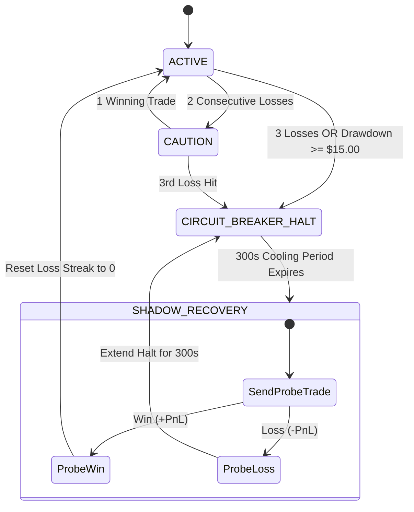

# Live Quantitative Operations & Self-Healing Runbook

> [!TIP] Production Readiness
> This runbook outlines the day-to-day operations, failure recovery protocols, and command-line instructions for managing the Three-Brain quantitative system on Binance BTC/USDT.

---

## 1. Directory Structure & File Map

```text
D:/projects/QUANT/
│
├── live_quant_server.py         # BRAIN 1: Real-time Binance WebSocket + kdb+ RDB + FastAPI
├── live_dashboard.html          # Web Terminal: Dark-mode Citadel-style 60 FPS canvas chart
│
├── brain2_safety_governor.py    # BRAIN 2: Risk FSM, Circuit Breaker & Config Gatekeeper
├── active_config.json           # Live promoted parameters loaded by Brain 1
├── strategy_config.json         # Candidate proposal emitted by Brain 3
│
├── ai_quant_agent.py            # BRAIN 3: Autonomous AI Research Scientist daemon
│
├── rust_engine/                 # FAST COMPILED ENGINE (Ponytail: 1-file zero-heap)
│   ├── Cargo.toml
│   └── src/main.rs              # Sub-microsecond O(1) ring buffer hot loop
│
├── data/
│   ├── live_ticks.csv           # Streaming tick plant persistence (kdb HDB equivalent)
│   ├── live_trades.csv          # Real-time executed paper trades log
│   └── experiments.jsonl        # Persistent Experiment Memory Ledger
│
└── 13-three-brain-architecture.md  # System Design & Mathematical Topology
```

---

## 2. Starting the Production System

### Step 1: Start Brain 1 (Live Execution Server & Dashboard)
Launches the Binance WebSocket connection, initializes the 50,000-tick in-memory columnar buffer, and serves the web terminal at port `8000`:

```powershell
python -u D:/projects/QUANT/live_quant_server.py
```
- Open browser at: **`http://localhost:8000`**
- WebSocket feed: `ws://localhost:8000/ws`
- Features: 60 FPS real-time Chart.js stream, Z-Score gauge, trade history table, and one-click CSV export.

---

### Step 2: Start Brain 3 (Autonomous AI Research Daemon)
Launches the background self-healing research scientist. It polls trade logs every 15 seconds, detects performance drift, runs the statistical battery, and automatically optimizes parameters:

```powershell
python -u D:/projects/QUANT/ai_quant_agent.py
```

To run a single diagnostic cycle without entering the continuous daemon loop:
```powershell
python D:/projects/QUANT/ai_quant_agent.py --once
```

---

### Step 3 (Optional): Run the High-Performance Rust Engine
For pure sub-microsecond tick replay and ultra-low latency execution:

```powershell
# One-time toolchain install (if rustc is not installed):
winget install Rustlang.Rustup

# Run release build benchmark:
cd D:\projects\QUANT\rust_engine
cargo run --release
```

---

## 3. The Autonomous Self-Healing Handshake



### Zero-Downtime Dynamic Hot-Reloading:
Every 50 ticks, `live_quant_server.py` checks `os.path.getmtime("active_config.json")`.
When Brain 2 approves a new parameter set:
1. Brain 2 writes to [`active_config.json`](file:///D:/projects/QUANT/active_config.json).
2. Brain 1 detects the modified timestamp on the next tick.
3. Brain 1 hot-reloads `entry_z`, `exit_z`, `stop_loss_usd`, and `cooldown_sec` in memory **without dropping the Binance WebSocket connection**.

---

## 4. Operational Monitoring & CLI Diagnostics

### Check Live Ticks Streaming:
```powershell
Get-Content D:\projects\QUANT\data\live_ticks.csv -Tail 10
```

### Check Live Executed Trades:
```powershell
Get-Content D:\projects\QUANT\data\live_trades.csv -Tail 10
```

### Inspect the AI Experiment Memory Ledger:
```powershell
Get-Content D:\projects\QUANT\data\experiments.jsonl -Tail 5
```

### Check if Port 8000 is Active:
```powershell
netstat -ano | findstr :8000
```

### Emergency Stop:
To kill the live server immediately:
```powershell
# Find PID on port 8000
netstat -ano | findstr :8000
# Force terminate
taskkill /PID <PID> /F
```

---

## 5. Related Vault Documents
- [[13-three-brain-architecture|13: Three-Brain Quantitative Architecture]]
- [[14-microstructure-diagnostics-and-math|14: Quantitative Microstructure Diagnostics & Math]]
- [[08-paper-trading-and-live-ops|08: Paper Trading & Operational Hygiene]]
