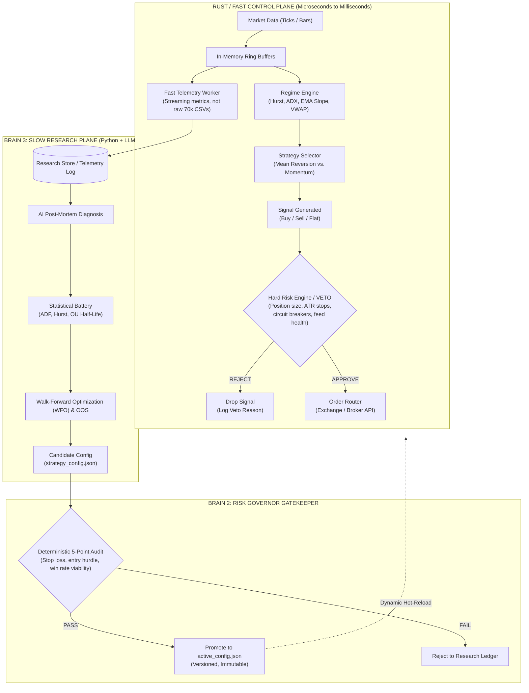

# Self-Healing vs. Self-Modifying Architecture

> [!CAUTION] The Golden Quant Rule
> **Self-Healing is NOT Self-Modifying.**
> - **Self-Modifying (Dangerous):** Market Noise $\to$ Real-Time Half-Life Calculation $\to$ Mutate Cooldown / Z-Score $\to$ Live Trade $\to$ **Live Overfitting Trap**.
> - **Self-Healing (Institutional):** Market Anomaly $\to$ **Deterministic Safe Mode (Halt / Reduce Size)** $\to$ Offline AI Diagnosis $\to$ Walk-Forward / OOS Validation $\to$ Risk Governor Audit $\to$ Versioned Config $\to$ **Live Promotion**.

---

## 1. The Core Architecture

---

## 2. The Three Cardinal Separations

### 1. Strategy $\ne$ Risk (File 06 Compliance)
- The Strategy Engine **proposes** a trade (`Signal`).
- The Strategy Engine has **zero authority** to route orders to an exchange.
- The Risk Service acts as an independent execution gatekeeper with **unconditional VETO power**.
- If a strategy bug triggers 100 buy orders in 1 second, the Risk Engine drops 97 of them at the gate.

### 2. Telemetry $\ne$ Research
- **Fast Telemetry (Hot Path):** Pre-computes and pushes structured metrics ($Z$, VWAP, EMA slope, execution slippage) from the in-memory ring buffer.
- **Slow Research (Cold Path):** Ingests telemetry offline. Runs heavy mathematical regressions (ADF unit root, Hurst exponent, OU half-life decay, parameter grid sweeps, LLM macro sentiment) over minutes or hours.

### 3. Anomaly Response $\ne$ Parameter Mutation
- When performance degrades (e.g. 3 consecutive losses or session drawdown limit):
  - The live engine **does not guess new parameters on the fly**.
  - The live engine **drops risk** (`ACTIVE` $\to$ `CAUTION` $\to$ `CIRCUIT_BREAKER_HALT`).
  - Parameter changes require the full **WFO $\to$ OOS $\to$ Risk Governor Audit** pipeline.

---

## 3. Files 05–11 Institutional Mapping

| File | Architectural Role | Hot Path vs. Cold Path |
|---|---|---|
| [[05-momentum-and-ai-features|05]] | Momentum Alpha & Async LLM Worker | **Cold:** LLM scores news asynchronously into Redis; **Hot:** Strategy reads latest cached float. |
| [[06-risk-engine|06]] | Hard Risk Guardrails & Independent Veto | **Hot:** Position sizing, ATR stops, hard dollar stops, and kill-switches. |
| [[07-backtesting-hygiene|07]] | Validation, WFO & OOS Testing | **Cold:** Prevents lookahead leaks, p-hacking, and overfitted parameter sweeps. |
| [[08-paper-trading-and-live-ops|08]] | Paper Trading, Reconciliation & Ops | **Hot/Cold:** Mock router (`DRY_RUN = True`), state reconciliation, and crash recovery. |
| [[09-industry-stack.md|09]] | Technology & Horizon Calibration | Calibration: Competing at seconds-to-hours intraday horizon. |
| [[10-system-design-playbook.md|10]] | 7-Layer Blueprint & Build Order | Architecture reference for layer boundaries. |
| [[11-chart-cheatsheet.md|11]] | Human Live-Session Battlecard | Operator situational awareness. |

---

## 4. Vault Navigation
- [[13-three-brain-architecture|13: Three-Brain Quantitative Architecture]]
- [[14-microstructure-diagnostics-and-math|14: Quantitative Microstructure Diagnostics & Math]]
- [[15-live-operations-and-self-healing-runbook|15: Live Operations & Self-Healing Runbook]]
- [[00-START-HERE|00: Master Vault Index]]
