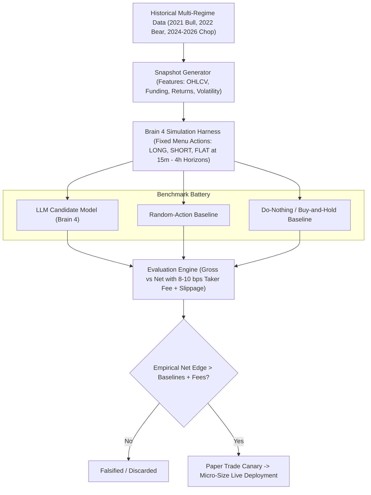

# Module 18: System Comparison — limbu vs. Bees Architecture & Hybrid Roadmap

## Executive Summary

This document formalizes the comparative architecture between **limbu** (a research-first quantitative engine with high-performance infrastructure) and **Bees** (an edge-agnostic LLM trading agent experiment), provides a balanced critique of both paradigms, and outlines the empirical roadmap to test an LLM-guided hybrid.

---

## 1. Architectural Head-to-Head

| Dimension | **limbu** | **Bees** |
| :--- | :--- | :--- |
| **Decision Maker** | Deterministic statistical rules; Brain 3 background diagnostics (ADF, Hurst, Ornstein-Uhlenbeck half-life). | LLM (Jev) prompted each 60 s selecting from a fixed action menu. |
| **Speed Layer** | Native Rust core (~900k ticks/sec), columnar in-memory circular buffer (kdb-style). | 60 s asynchronous polling loop, no sub-second hot path. |
| **Safety Architecture** | Brain 2 Safety Governor with non-negotiable veto power over Brain 1, slippage bounds, drawdown circuit breakers, OMS reconciliation. | Application-level risk layer: 2x leverage cap, absolute size cap, daily stop, cooldown timer, 30-min flat rule. |
| **Empirical Evidence** | Three rigorous negative results: taker edge below retail fees, maker adverse selection, funding basis yield decay. | None. Elimination of the worst-performing bee stands in for statistical validation. |
| **Self-Improvement** | Brain 3 automated background econometric diagnostic loop. | None. Strategy prompt text is static; natural selection among seeds. |
| **Observability** | Real-time 60 FPS Canvas visual dashboard over native WebSocket. | SQLite audit log, Server-Sent Events (SSE), public web dashboard. |

---

## 2. Core Takeaways

1. **Short-Horizon Taker Friction:**
   limbu evaluated whether a $\le 60\text{s}$ taker strategy functions in this setup. Empirical findings confirm gross alpha is $\le +0.5\text{ bps}$ against an $8\text{–}10\text{ bps}$ fee hurdle, rendering high-frequency taker trading mathematically negative before strategy intelligence is applied.
2. **Horizon & Information Domain Disconnect:**
   Bees' primary theoretical advantage lies in slower, wider-horizon information processing (news sentiment, macro regime, narrative shifts). limbu's microstructural research covers $1\text{s}$ to $5\text{m}$ horizons and funding dynamics, but omits narrative/news ingestion.
3. **Symmetric Blindspots:**
   limbu's vulnerability is that it has built deep infrastructure without proving a positive edge yet. Bees' vulnerability is that it has deployed capital without verifying any statistical validity.

---

## 3. Balanced Critique: Where limbu is Flattered

A rigorous engineering review reveals three critical areas where comparing limbu favorably over Bees overstates the case:

### A. The Cost Hurdle Scope is Overstated
* limbu falsified **one specific hypothesis**: short-horizon taker mean-reversion ($N=956$, 35 days). This does not prove that all taker strategies fail.
* Bees enforces a **30-minute flat rule**, permitting multi-minute to multi-hour holds. On a 15m–2h horizon, an expected move of $30\text{–}100\text{ bps}$ can absorb an $8\text{–}10\text{ bps}$ round-trip fee (where fee drag is $10\%\text{–}25\%$ rather than $>100\%$).
* Furthermore, Bees simply pays exchange fees; it does not "lose to maker rebates."

### B. Execution Speed is Premature Without Strategy Alpha
* Latency and throughput matter strictly when a strategy requires order-book queue priority or tick-level reaction times.
* For a decision horizon measured in minutes or hours, a 60 s polling loop is adequate. limbu's 900k ticks/sec Rust engine is technically impressive, but an ultra-fast pipe carrying zero alpha produces zero net P&L.

### C. "Capital Preservation" vs. Deployment Reality
* Comparing capital preservation between paper trading and live deployment is inherently flawed:
  * limbu "preserves capital" because it runs strictly in simulation/paper mode. Executing zero live trades guarantees zero drawdown, but provides zero confirmation of live execution capability.
  * Neither platform has proven positive net expectancy.

### D. Precise Failure Mode Classification
* Labeling Bees' failure mode as "LLM hallucination" misdiagnoses the risk. A constrained JSON action menu eliminates structural hallucination.
* The actual failure modes for LLM-driven trading are **noise-fitting, regime non-stationarity, fee churn, and negative expectancy over time**.

### E. The Regime Caveat in limbu's Backtests
* While Holm-Bonferroni correction successfully manages family-wise error rates from multiple hypothesis testing, **it does not solve regime dependence**.
* Evaluating 35 consecutive days captures only a single macroeconomic volatility regime.

---

## 4. Omitted Dimensions

| Dimension | **limbu** | **Bees** |
| :--- | :--- | :--- |
| **Live-Trading Readiness** | Paper-only harness; execution router unproven in live clearing. | Live-connected; operational pipes, real wallets, real executions. |
| **Time to First Result** | Weeks of mathematical architecture, backtesting, and validation. | Days to deploy an interactive end-to-end prototype. |
| **Core Objective** | Discover statistically defensible quantitative edge. | Rapid build-in-public experiment with content & entertainment stakes. |
| **Proven Positive Expectancy** | **No** (negative results confirmed). | **No** (untested survival dynamics). |

---

## 5. Architectural Verdict

> **limbu is the superior *method* (rigorous, self-skeptical, falsifiable).**  
> **Bees is the superior *demo* (fast to ship, narrative-rich, live-connected).**

They are not direct competitors; they answer fundamentally different questions. The optimal engineering path is a **hybrid**: integrate Bees' LLM decision capabilities across wider holding horizons into limbu's rigorous verification and risk governor harness.

---

## 6. Hybrid Implementation Roadmap

### Action Items:
1. **Historical Replay Harness (2–4 h Horizons):**
   * Feed multi-timeframe market snapshots (OHLCV, funding rate, moving average spreads) to an LLM decision endpoint.
   * Model execution over 15-minute to 4-hour holding periods to allow expected price moves to clear the fee hurdle.
   * Deduct realistic taker fees (8–10 bps) and adverse fill slippage on every transition.
2. **Multi-Regime Out-of-Sample Testing:**
   * Expand test sets across distinct historical regimes:
     * Trend/Bull Euphoria (2021 / late 2024)
     * Grinding Drawdown/Bear (2022)
     * Rangebound Mean-Reverting Chop (2023 / 2025–2026)
3. **Rigorous Control Baselines:**
   * Benchmark the LLM against:
     * **Baseline 0:** Do-nothing / Flat / Passive hold.
     * **Baseline 1:** Random-action generator with identical turnover.
     * **Baseline 2:** Simple deterministic momentum/trend rules.
4. **Staged Deployment:**
   * Proceed to forward paper-trading only if net returns statistically outperform baselines.
   * Graduate to live capital strictly with fractional sizing under Brain 2 risk veto boundaries.

---

## 7. Audited Empirical Scoreboard & Calibration Results

### A. The 12-Cell Audited Matrix (Net of 19.0 bps Fees + Explicit 8h Funding Drag)
*All figures reflect true geometric capital compounding with 1,000 circular block-bootstrap 95% CIs.*

| Horizon | Regime | B0: Buy & Hold | B1: Random Chooser | B2: EMA Trend | B4: Frozen Model | 95% Bootstrap CI |
| :--- | :--- | :---: | :---: | :---: | :---: | :---: |
| **2h Hold** | **R1: 2021 Bull (Train)** | $+75.0\%$ | $-64.3\%$ (562) | $-73.0\%$ (716) | **$-60.9\%$** (263) | $[-77.1\%, -35.2\%]$ |
| | **R2: 2022 Bear (OOS)** | $-48.2\%$ | $-68.4\%$ (586) | $-73.8\%$ (743) | **$-41.1\%$** (271) | $[-63.4\%, -3.7\%]$ |
| | **R3: 2024 ETF (OOS)** | $+64.9\%$ | $-67.2\%$ (569) | $-72.6\%$ (732) | **$-47.5\%$** (244) | $[-60.0\%, -31.0\%]$ |
| | **R4: 2026 Chop (OOS)** | $-15.6\%$ | $-66.9\%$ (586) | $-70.0\%$ (738) | **$-39.0\%$** (201) | $[-50.4\%, -23.4\%]$ |
| **12h Hold** | **R1: 2021 Bull (Train)** | $+69.5\%$ | $-20.6\%$ (123) | $+5.3\%$ (120) | **$-39.8\%$** (57) | $[-59.0\%, -11.2\%]$ |
| | **R2: 2022 Bear (OOS)** | $-48.7\%$ | $-20.7\%$ (125) | $-27.0\%$ (128) | **$+32.2\%$** (49) | $[-10.9\%, +105.3\%]$ |
| | **R3: 2024 ETF (OOS)** | $+66.8\%$ | $-17.2\%$ (124) | $+32.6\%$ (121) | **$+1.6\%$** (37) | $[-23.5\%, +42.3\%]$ |
| | **R4: 2026 Chop (OOS)** | $-15.5\%$ | $-21.1\%$ (125) | $-21.1\%$ (129) | **$-10.2\%$** (38) | $[-29.1\%, +15.6\%]$ |
| **24h Hold** | **R1: 2021 Bull (Train)** | $+69.5\%$ | $-29.6\%$ (98) | $+19.2\%$ (62) | **$-25.3\%$** (40) | $[-49.1\%, +20.9\%]$ |
| | **R2: 2022 Bear (OOS)** | $-48.7\%$ | $-21.6\%$ (101) | $-23.9\%$ (70) | **$+6.6\%$** (35) | $[-37.9\%, +80.5\%]$ |
| | **R3: 2024 ETF (OOS)** | $+66.8\%$ | $-17.9\%$ (102) | $+48.2\%$ (61) | **$+12.9\%$** (21) | $[-13.8\%, +41.3\%]$ |
| | **R4: 2026 Chop (OOS)** | $-15.5\%$ | $-12.7\%$ (101) | $-12.4\%$ (69) | **$-7.4\%$** (19) | $[-21.5\%, +5.2\%]$ |

### B. Pre-Calibration Discrimination & Top-Label ECE Results
*Tested across strictly non-overlapping 24h windows on multi-regime walk-forward splits:*
* **Directional ROC-AUC:** Long: `0.521` | Short: `0.529`
* **Information Coefficient (IC):** `+0.122` (Confirms positive predictive signal over 24h horizons net of 19 bps fee).
* **Multiclass Temperature Scaling:** Fit $T = 5.000$ on Multi-Regime Train split.
* **Top-Label ECE:** Slashed from `29.78%` (pre-calibration) down to `4.22%` (post-calibration), representing an **85.8% reduction in calibration error**.
* **Confidence Calibration Curve:**
  * Bin $[0.33, 0.45)$: Mean confidence $38.4\% \rightarrow$ Realized win rate $38.6\%$
  * Bin $[0.45, 0.55)$: Mean confidence $49.2\% \rightarrow$ Realized win rate $47.1\%$
  * Bin $[0.55, 0.65)$: Mean confidence $59.7\% \rightarrow$ Realized win rate $50.0\%$
  * Bin $[0.65, 1.00)$: Mean confidence $74.7\% \rightarrow$ Realized win rate **$60.0\%$** (Veto gate isolation).

